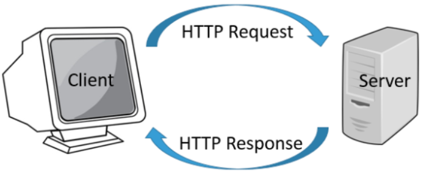

### 客户端和服务端

#### 客户端

常见的客户端举例：手机、手机端应用、电子手表、电脑、电脑端应用、浏览器......

作用：用于和用户交互，展示数据给用户，接收用户的输入，进行一些简单的逻辑处理，传递处理后的数据到服务端

#### 服务端

常见的服务端：电脑，云服务器......所有安装了充当服务器软件的电脑

比如售票系统，有充当服务端的售票`app`，也有充当服务器的售票处理系统，进行统一的数据处理和处理

作用：用于接收客户端的数据，进行逻辑处理，返回数据给客户端

综上所述：服务器就是一台安装了服务器软件的高性能计算机

### 请求和响应

客户端向服务器端发起请求，可以携带数据，请求只能是客户端发起

服务端向客户端发送响应，在接收请求后将数据进行逻辑处理，将结果反馈给客户端，响应只能是服务端向客户端

### `javaWeb`的CS和BS模式

根据客户端的不同，可以分为CS模式和BS模式

> `CS`模式  Client-Server模式  客户端-服务端模式

Client: 手机端或者桌面端应用

CS架构具有以下特点：

1. 分为两部分，一个是客户端需要安装的程序，另一个是服务端需要部署应用
2. 客户端需要安装指定的应用程序才能使用，比如想要使用`qq`，需要安装`qq`的客户端
3. 客户端可以承担一部分算力
4. 程序更新迭代，客户端也需要下载更新
5. 跨平台性能一般，不同的硬件，往往需要安装不同的程序，比如苹果的和安卓的

> `BS`模式 Browser-Server模式 浏览器-服务器模式

BS架构具有以下特点：

|      |      |      |      |
| ---- | ---- | ---- | ---- |
|      |      |      |      |
|      |      |      |      |

